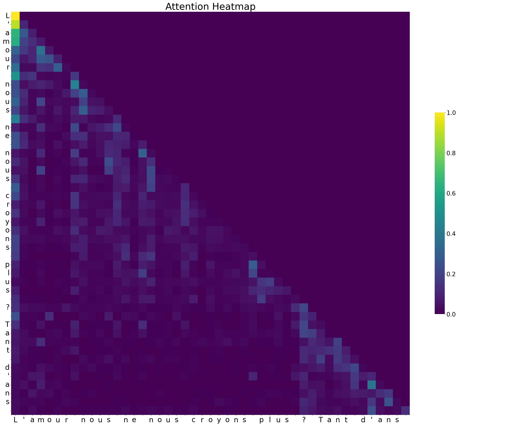

# French Poeme Generator : The Literary Style Copier 

I developed this deep learning project as an end-to-end implementation of an autoregressive character-level language model using PyTorch. 

The architecture of the network is heavily inspired by the "Attention Is All You Need" paper. 

I designed the project to be modular and object-oriented. You can train it on any dataset (a .txt file) and it will generate text in the same style and language as the dataset.

## Datasets

I trained and evaluated the model on two different textual datasets. This allowed me to test the network's versatility across different linguistic structures.

*   **Shakespeare Dataset**: I used this dataset to train the model to generate classic English theatrical dialogues.

*   **French Poetry Dataset**: I used this dataset to train the model to structure and generate classical French poetry.

## Generation Capabilities

The following excerpts are real, unedited examples of text generated by my model after its training phase. It is clear that there is no sens in the generated text, but one can identify the style and the language.

### French Generation (Poetry)

```text
Où je merbe la triste,
J'aime mes partout ;
Et je te soi, je l'ai terriblais
M'est-il afin que toi qu'elle fait.
Mais beau vieil
```

### English Generation (Shakespeare)

```text
KING RICHARD II:
Let thy queen and so eye the other ks
Who shakes, Margaret; or that your stood thiveous Mercius
Your few, I have nothing mode only your father,
I three alway.
```

### Visualizing Attention



This attention heatmap illustrates how the model distributes its "attention" during generation:
*   **Axes**: They represent the sequence of generated characters. The vertical axis (Y) is the character currently being processed, and the horizontal axis (X) is the past context.
*   **Intensity**: Brighter areas indicate strong attention. To predict a specific character (Y-axis), the model relied heavily on the corresponding character (X-axis).
*   **Structure**: The triangular shape demonstrates causal masking (the model can only look at the past).
*   **Remarks**:
    *   **The Diagonal**: Highly active because a character often refers to itself.
    *   **Bright Vertical Columns**: A bright column indicates a character (X-axis) that provides essential context for the rest of the sequence.
    *   **Semantic Relations**: Bright spots between distant characters indicates grammatical or word-level dependencies.

## Architecture and Methods

I structured the code using object-oriented principles. The key elements are divided into data manipulation, neural network architecture, and the training paradigm.

### Network Architecture

The network is a Decoder-only Transformer. It specifically incorporates the following components:

*   **Embeddings**: Token embeddings to represent the character vocabulary and Positional Embeddings to encode sequence location information.

*   **Attention Blocks**: A stack of Multi-Head Self-Attention layers. This allows the network to process relationships across the context dimension.

*   **Feed-Forward Network**: Linear neural network components with ReLU activation placed after the attention blocks.

*   **Normalization & Regularization**: I applied Pre-Layer Normalization and Dropout layers to ensure training stability and prevent overfitting.

*   **Output Layer**: A final linear transformation layer that generates a vector of logits for vocabulary prediction.

### Data Processing

I created the `TextDataset` class to manage the data pipeline. 

It automatically builds a vocabulary dictionary from the raw source text. It also encodes characters into discrete integer tensors. Finally, it cleanly separates the training and validation datasets, and generates the batch tensors required for training.

### Model Execution

I encapsulated the entire model management logic inside the `Model` class. This class uses the AdamW optimizer and evaluates Cross-Entropy loss. 

I implemented several core methods inside this class:

*   `train()`: This method runs the main training loop. It handles forward propagation, loss calculation, backpropagation, and weight updates.

*   `estimate_loss()`: A gradient-free utility method. It calculates the average loss across multiple iterations for both training and validation sets to monitor learning progress.

*   `generate()`: This method prompts the trained model to predict and output brand new text based on an initial context vector.

*   `save(path)`: This method serializes and saves the model's trained weights to a file.

*   `load(path)`: This method loads pre-existing weights, allowing me to resume training or execute text generation without retraining from scratch.
